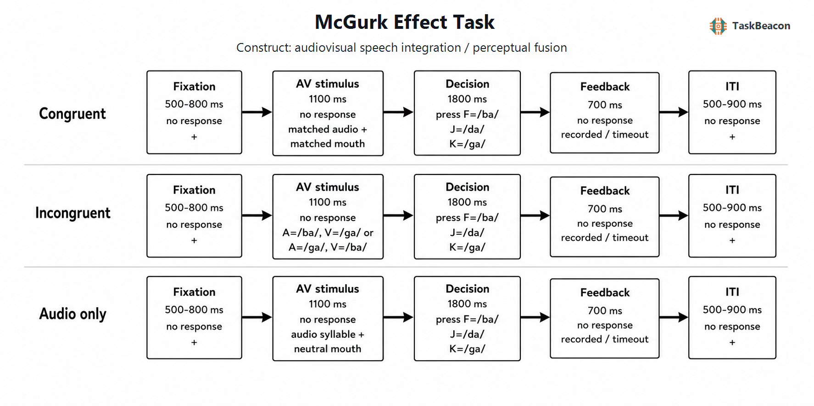

# 麦格克效应范式：视听言语整合的实验逻辑、神经基础与测量边界

面对面言语知觉同时利用声学信号与说话者的口唇运动。研究这一过程的核心困难在于：视、听线索在自然言语中通常高度相关，单凭一致刺激下的正确率提升，难以区分单通道识别、跨通道绑定与反应决策。麦格克效应（McGurk effect）通过有控制地制造音位—视素冲突，使视觉发音信息改变对听觉音节的分类，因此成为检验视听言语整合最常用的实验范式之一（McGurk & MacDonald, 1976）。其典型现象是听觉 /ba/ 与视觉 /ga/ 同步呈现时，部分观察者报告并未实际呈现的 /da/ 融合知觉；反向配对则更常产生音节组合或听觉主导反应。该不对称性表明，效应取决于具体音位的声学与构音特征，而非任意不一致刺激都会诱发融合（MacDonald & McGurk, 1978; Alsius et al., 2018）。

麦格克范式的价值在于把视觉影响落实为可重复操控的试次对比，并允许在行为、功能磁共振成像（functional magnetic resonance imaging, fMRI）和脑电图（electroencephalography, EEG）上追踪冲突信息的绑定与解析。其局限同样源于这种高度人工化的冲突：融合报告既受感觉证据影响，也受刺激材料、作答集合、时间同步、注意和分类不确定性影响。因而，麦格克融合率适合描述特定材料和测量条件下的视听语音知觉，不宜直接等同于日常交流中的多感觉整合能力（Getz & Toscano, 2021; Van Engen et al., 2022）。

## 1. 范式提出与理论发展

McGurk 与 MacDonald（1976）最初在研究儿童言语知觉时，将一个说话者发出 /ga/ 的画面与 /ba/ 的录音配对，发现成人和儿童均可能把同步冲突刺激报告为 /da/。仅听录音或观看未经配音的影片时，参与者能够正确识别原始音节，说明融合不是单一通道刺激本身的误识别。后续实验扩展了说话者、音节、语言背景与呈现方式，并区分两类常见结果：融合反应指报告第三个音位，例如 A/ba/+V/ga/→/da/；组合反应指报告包含两个成分的序列，例如 A/ga/+V/ba/→/gaba/。这一区分不能被压缩为一个笼统的“视觉捕获”指标，因为两类反应对应的跨通道兼容性与分类过程不同（MacDonald & McGurk, 1978; Alsius et al., 2018）。

早期解释强调听觉与视觉特征在分类前即被联合使用。现代模型进一步把任务分为来源判断与线索融合两个问题：观察者先估计声音和口型是否来自同一事件，再依据各通道证据的可靠性形成音位后验分布。因果推断模型可以同时解释为何 A/ba/+V/ga/ 常被整合、而相近的反向配对较少形成同类融合；始终强制整合的模型则难以拟合这种刺激级差异（Magnotti & Beauchamp, 2017）。改变视听时间偏移及两通道信噪比的研究也表明，绑定倾向与融合权重可以在同一实验内分别估计，贝叶斯模型对一致言语的增强效应和不一致言语的错觉均具有解释力（Lindborg & Andersen, 2021）。这些结果支持知觉推断解释，但模型参数仍依赖特定说话者、音位集合与反应任务，不能直接视为个体恒定的整合机制。

## 2. 任务逻辑、流程与主要指标

经典试次至少包含一致视听、麦格克不一致、单一听觉和单一视觉条件。一致条件检验基础音位识别与视听匹配；单通道条件估计各通道的可辨识度；不一致条件则量化视觉信息如何改变听觉分类。实验通常先呈现注视点，随后同步播放说话者视频与音节录音，再要求参与者开放报告或在预设音节中选择所感知的内容。开放报告较少显式提示融合类别，但编码成本较高；强迫选择提高试次效率，却可能因是否提供 /da/ 选项而改变融合率（Getz & Toscano, 2021）。即时反馈一般只确认反应已记录，不把某一主观知觉标作客观正确，否则可能形成反应学习。

时间关系是构念解释的必要条件。视听语音允许一定范围的异步，但偏移增大时，同源性判断与融合概率下降；容许窗口对“视觉领先”和“听觉领先”并不对称（Munhall et al., 1996）。因此，报告同步方式、音视频起始点、刺激时长和设备延迟是复现实验的必要信息。若研究关注时间绑定，应系统改变视听起始差并拟合心理测量函数；若关注融合倾向，则应固定同步并以足够多的说话者和刺激重复估计个体差异。

主要行为因变量是不一致试次中融合反应比例，同时应报告一致条件和听觉单通道的识别率、各反应类别分布、漏答率与反应时。`不一致条件 /da/ 报告率` 相对于 `听觉单通道 /da/ 误报率` 的增加，较能排除音频本身含混造成的假融合；一致条件表现则用于识别普遍的音位分类困难。反应时反映分类与决策负荷，不能单独作为整合强度指标。将所有不一致反应均计为“整合”也会混淆融合、组合、视觉主导和随机误报，研究设计应在刺激级保存完整反应分布。

## 3. 主要行为与神经科学发现

### 3.1 融合知觉、个体差异与计算解释

麦格克效应在群体水平易于诱发，但个体间与刺激间变异很大。同一参与者对不同说话者或不同刺激实例的融合率可显著变化；对固定刺激集合而言，个体排序又可在数月至一年内保持较高稳定性（Strand et al., 2014; Basu Mallick et al., 2015）。这说明稳定性和普遍性需要分别判断：某一测量可以稳定地区分参与者，却未必代表跨材料的一般视听整合能力。视觉唇读能力能够解释部分融合差异，但融合识别与视听不一致检测仅中度相关，且一般认知能力、知觉风格等候选解释并未稳定预测融合率（Strand et al., 2014; Brown et al., 2018）。

刺激与任务因素对效应大小具有实质影响。固定同一材料而改变开放报告、强迫选择以及是否在选项中出现融合音节，可使融合率出现大幅波动（Getz & Toscano, 2021）。注意负荷、说话者视觉可辨识度、语言经验与视听同步也会改变可利用的证据。因而，“未报告 /da/”只说明该试次未产生预先定义的融合反应，不能推出视觉信息未被处理或跨通道整合完全失败。因果推断模型把这种变异解释为共同来源概率、单通道不确定性和融合权重的联合结果，比把融合率直接作为单一能力分数更符合刺激级反应模式（Magnotti & Beauchamp, 2017; Lindborg & Andersen, 2021）。

### 3.2 fMRI 与 EEG 证据

fMRI 研究较一致地将麦格克知觉与上颞沟及其相邻听觉—视听网络联系起来。同步视听语音发生知觉融合时，上颞沟活动及其与额下回等区域的协同变化不同于未融合或时间不匹配试次（Miller & D'Esposito, 2005）。个体融合率与左上颞沟对麦格克刺激的反应相关；以个体 fMRI 定位结果为靶点施加经颅磁刺激，可降低融合报告，为该区域的必要参与提供了比单纯 BOLD 相关更强的证据（Beauchamp et al., 2010; Nath & Beauchamp, 2012）。不过，上颞沟并非“融合中心”，区域活动同时受感觉可靠性、音位分类和任务要求影响。

近期 fMRI 结果进一步表明，麦格克刺激相对于一致视听刺激引起的额叶、岛叶及辅助运动区活动增加，可由参与者反应分布的熵解释；控制知觉不确定性后，条件差异显著减弱（Dong et al., 2024）。这项结果支持麦格克刺激与一致视听言语共享部分推断过程，同时提示常用的 `不一致 > 一致` 对比混入了冲突和分类难度。fMRI 能确定网络参与及空间分布，不能仅凭条件相关活动证明某区域产生了融合知觉。

EEG/事件相关电位（event-related potential, ERP）提供了阶段性证据。不一致视听音节能够诱发与语音类别偏差有关的失匹配负波，表明视觉信息已进入早期音位表征，而非只在按键阶段改变报告（Colin et al., 2002）。时频分析还发现，视听不一致与融合结果对左右感觉运动 μ 节律的事件相关去同步化具有不同影响：右侧变化更接近一般冲突检测，左侧变化随融合和音位解析而改变（Jenson, 2021）。这些结果说明检测不一致与解决音位冲突在时间上可分，但头皮 EEG 的源定位和功能命名均需谨慎；尤其不能由侧化振荡直接推断特定运动表征造成了错觉。

## 4. 发展、临床与方法学应用

麦格克范式已用于考察语言经验、儿童发展、老化、听力损失和自闭症相关的视听言语加工。应用价值主要在于同一试次可分离单通道识别、视听一致与冲突反应。以自闭症为例，儿童融合率与交流能力之间可见相关，但样本量、年龄、注视口部的程度和单通道识别均可能调节结果，群体差异不能转化为个体诊断（Feldman et al., 2022）。大样本成人在线研究则发现年龄而非自闭症诊断更稳定地预测麦格克/麦克唐纳范式表现，说明儿童期结果不应直接外推至整个成年期（Jertberg et al., 2024）。

发展与临床研究尤其需要避免把较低融合率解释为“整合缺陷”。融合减少可能来自听觉辨识更强、视觉音位提取较弱、注视位置不同、时间绑定窗口变窄，或参与者更容易察觉两个来源。适宜的设计应同时测量单通道识别、视听一致增益、时间同步判断和眼动，并将症状或功能指标作为连续变量。麦格克任务由此可作为机制探针或实验分层指标，但现有证据不足以支持其独立用于临床筛查。

## 5. 信度、效度与解释边界

固定刺激与识别规则下，融合比例可显示良好的重测相关；增加每位参与者的刺激实例和重复次数，有助于降低二项抽样误差（Strand et al., 2014; Basu Mallick et al., 2015）。然而，刺激特异性会限制跨说话者和跨实验室的可推广性。报告总体融合率而不呈现刺激级分布，可能把少数高诱发材料的效应误作稳定个体特征。反应选项、音视频同步精度、听觉信噪比和视觉清晰度也应预先固定或纳入分层模型。

构念效度的核心限制在于，麦格克融合与自然一致视听言语的识别增益往往相关较弱。自然交流以词、句和连续话语中的一致线索为主，而麦格克任务使用孤立音节与人为冲突；两者对词汇、语境、注意和不确定性的要求不同（Van Engen et al., 2022）。因此，麦格克范式能够证明视觉发音信息改变了特定听觉分类，并可检验来源推断和冲突解析；它不能单独估计日常交流获益，也不能由群体平均效应推出个体神经机制。研究若以一般视听言语能力为目标，应把麦格克指标与一致言语噪声识别、唇读和时间绑定测量联合使用。

## 6. TaskBeacon 中的任务实现

### 6.1 任务资源与访问入口

| 资源 | ID | 用途 | 地址 |
|---|---|---|---|
| 完整行为实验实现 | T000026 | 本地 PsychoPy/PsyFlow 实验与数据记录 | https://github.com/TaskBeacon/T000026-mcgurk |
| 浏览器原型源码 | H000026 | 与主要条件和按键规则对齐的网页实现 | https://github.com/TaskBeacon/H000026-mcgurk |

两项资源的公开源码地址均已核验。当前仓库元数据将 T000026 标记为行为采集版，将 H000026 标记为行为型 HTML 原型；现有一手元数据未提供可核验的公共直接运行地址，因此不将本地开发服务器地址列为公共入口。

### 6.2 实现流程与关键参数

TaskBeacon 当前版本设置 3 个区组、共 90 个试次，每区组 30 次；一致、不一致和仅听觉条件按近似等量日程随机呈现。一致条件从 /ba/、/da/、/ga/ 中抽取相同的听觉音节和口型；不一致条件抽取 A/ba/+V/ga/ 或 A/ga/+V/ba/；仅听觉条件呈现三个音节之一并配中性静止口型。主要指标为不一致试次中报告 /da/ 的比例，同时记录完整反应类别、反应时和超时。该实现没有按表现调节刺激的自适应算法，控制器只负责条件配平、随机抽样和试次历史记录。

**图 1. TaskBeacon 麦格克效应任务的条件与试次时序。** 每个试次依次经历 500–800 ms 注视、1100 ms 视听刺激、最长 1800 ms 知觉报告、700 ms 状态反馈及 500–900 ms 试次间隔。一致条件中声音与口型相同；不一致条件为 A/ba/+V/ga/ 或 A/ga/+V/ba/；仅听觉条件以中性口型伴随音节。参与者按 F、J、K 分别报告 /ba/、/da/、/ga/。反馈只提示反应已记录或超时，不提供客观正误；不一致条件报告 /da/ 被编码为融合反应。固定点和试次间隔采用区间内随机时长，任务不依据融合率调整后续参数。

该实现把报告窗口置于刺激呈现之后，因而反应时从决策阶段开始计量，不能解释为自音节起始计算的在线识别潜伏期。程序化几何口型与单个音频样本提高了条件控制，却弱化了自然说话者的动态构音信息；所得融合率应限定为该刺激集合下的分类结果。区组及全程汇总呈现作答率、平均反应时、音节分布和不一致条件融合率，适合行为演示与基础实验，若用于精细的视听言语机制研究，仍需增加多说话者动态视频、单通道视觉基线及音视频延迟标定。

## 参考文献

Alsius, A., Paré, M., & Munhall, K. G. (2018). Forty years after hearing lips and seeing voices: The McGurk effect revisited. *Multisensory Research, 31*(1–2), 111–144. https://doi.org/10.1163/22134808-00002565

Basu Mallick, D., Magnotti, J. F., & Beauchamp, M. S. (2015). Variability and stability in the McGurk effect: Contributions of participants, stimuli, time, and response type. *Psychonomic Bulletin & Review, 22*(5), 1299–1307. https://doi.org/10.3758/s13423-015-0817-4

Beauchamp, M. S., Nath, A. R., & Pasalar, S. (2010). fMRI-guided transcranial magnetic stimulation reveals that the superior temporal sulcus is a cortical locus of the McGurk effect. *The Journal of Neuroscience, 30*(7), 2414–2417. https://doi.org/10.1523/JNEUROSCI.4865-09.2010

Brown, V. A., Hedayati, M., Zanger, A., Mayn, S., Ray, L., Dillman-Hasso, N., & Strand, J. F. (2018). What accounts for individual differences in susceptibility to the McGurk effect? *PLOS ONE, 13*(11), e0207160. https://doi.org/10.1371/journal.pone.0207160

Colin, C., Radeau, M., Soquet, A., Demolin, D., Colin, F., & Deltenre, P. (2002). Mismatch negativity evoked by the McGurk–MacDonald effect: A phonetic representation within short-term memory. *Clinical Neurophysiology, 113*(4), 495–506. https://doi.org/10.1016/S1388-2457(02)00024-X

Dong, C., Noppeney, U., & Wang, S. (2024). Perceptual uncertainty explains activation differences between audiovisual congruent speech and McGurk stimuli. *Human Brain Mapping, 45*(5), e26653. https://doi.org/10.1002/hbm.26653

Feldman, J. I., Conrad, J. G., Kuang, W., Tu, A., Liu, Y., Simon, D. M., Wallace, M. T., & Woynaroski, T. G. (2022). Relations between the McGurk effect, social and communication skill, and autistic features in children with and without autism. *Journal of Autism and Developmental Disorders, 52*(5), 1920–1928. https://doi.org/10.1007/s10803-021-05074-w

Getz, L. M., & Toscano, J. C. (2021). Rethinking the McGurk effect as a perceptual illusion. *Attention, Perception, & Psychophysics, 83*(6), 2583–2598. https://doi.org/10.3758/s13414-021-02265-6

Jenson, D. (2021). Audiovisual incongruence differentially impacts left and right hemisphere sensorimotor oscillations: Potential applications to production. *PLOS ONE, 16*(10), e0258335. https://doi.org/10.1371/journal.pone.0258335

Jertberg, R. M., Begeer, S., Geurts, H. M., Chakrabarti, B., & Van der Burg, E. (2024). Age, not autism, influences multisensory integration of speech stimuli among adults in a McGurk/MacDonald paradigm. *European Journal of Neuroscience, 59*(11), 2979–2994. https://doi.org/10.1111/ejn.16319

Lindborg, A., & Andersen, T. S. (2021). Bayesian binding and fusion models explain illusion and enhancement effects in audiovisual speech perception. *PLOS ONE, 16*(2), e0246986. https://doi.org/10.1371/journal.pone.0246986

MacDonald, J., & McGurk, H. (1978). Visual influences on speech perception processes. *Perception & Psychophysics, 24*(3), 253–257. https://doi.org/10.3758/BF03206096

Magnotti, J. F., & Beauchamp, M. S. (2017). A causal inference model explains perception of the McGurk effect and other incongruent audiovisual speech. *PLOS Computational Biology, 13*(2), e1005229. https://doi.org/10.1371/journal.pcbi.1005229

McGurk, H., & MacDonald, J. (1976). Hearing lips and seeing voices. *Nature, 264*(5588), 746–748. https://doi.org/10.1038/264746a0

Miller, L. M., & D'Esposito, M. (2005). Perceptual fusion and stimulus coincidence in the cross-modal integration of speech. *The Journal of Neuroscience, 25*(25), 5884–5893. https://doi.org/10.1523/JNEUROSCI.0896-05.2005

Munhall, K. G., Gribble, P., Sacco, L., & Ward, M. (1996). Temporal constraints on the McGurk effect. *Perception & Psychophysics, 58*(3), 351–362. https://doi.org/10.3758/BF03206811

Nath, A. R., & Beauchamp, M. S. (2012). A neural basis for interindividual differences in the McGurk effect, a multisensory speech illusion. *NeuroImage, 59*(1), 781–787. https://doi.org/10.1016/j.neuroimage.2011.07.024

Strand, J., Cooperman, A., Rowe, J., & Simenstad, A. (2014). Individual differences in susceptibility to the McGurk effect: Links with lipreading and detecting audiovisual incongruity. *Journal of Speech, Language, and Hearing Research, 57*(6), 2322–2331. https://doi.org/10.1044/2014_JSLHR-H-14-0059

Van Engen, K. J., Dey, A., Sommers, M. S., & Peelle, J. E. (2022). Audiovisual speech perception: Moving beyond McGurk. *The Journal of the Acoustical Society of America, 152*(6), 3216–3225. https://doi.org/10.1121/10.0015262
